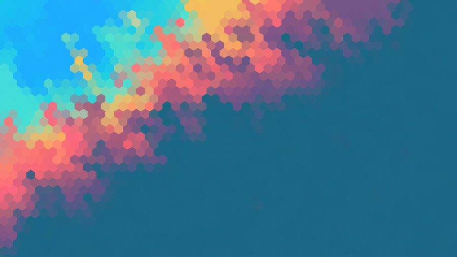
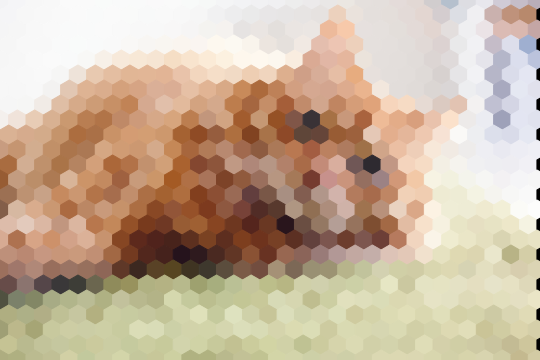
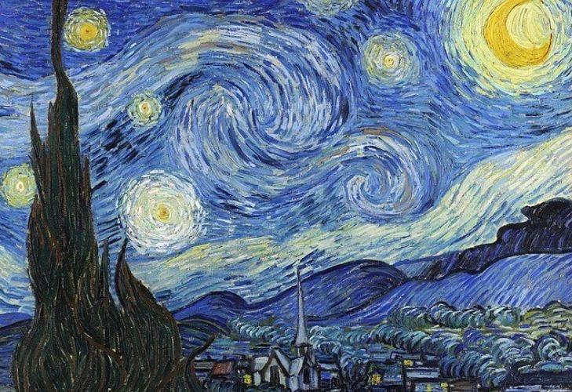
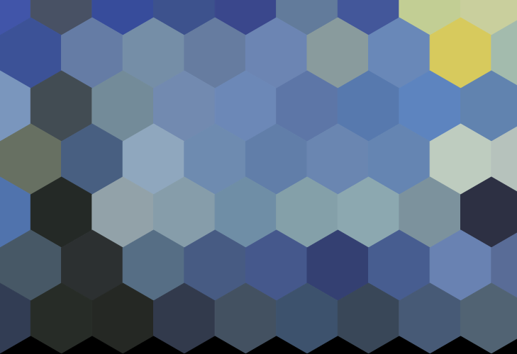

# Hexagonal Wallpaper Generator

This project, developed as part of the **Refresher Computer Science** course, enables the generation of high-quality **SVG** images using hexagons. This method allows images that were initially of low resolution to be rendered in a higher, scalable quality.

The project offers an efficient and flexible image generation process for the user:

* **User Interface**: With `generator_app.py`, the **Marimo** file allows for an interactive use of the class, making the project easy for the user to operate.
* **Object-Oriented**: Wallpaper creation is handled through the **Hexagonal** class, ensuring a standardized generation process.
* **Flexibility**: The user can easily choose an input image of any size and decide on the specific size they want for the hexagons.
* **Testing**: all the function in the class are tester.

## Installation & Usage

To run the interactive generator, use the following command:

```bash
poetry install
poetry run marimo edit src/svg_wallpaper_gen/hexa_generator_app.py

## Installation
Clone the project: 
```bash
git clone git@github.com:GwennGrs/codewars.git
```

Install the dependencie:
```bash
poetry install
```

## Usage
To use this project, you can launch the Marimo file with the command:
```bash
poetry run marimo edit src/svg_wallpaper_gen/generator_app.py
```

After this you can use the input pannel to choose:
* the path of your input file
* the size of the hexagon you want
* the path of the ouput file

Marimo will show you your generated picture and you can find it in the `/img` repository.

## Some examples 
#### The classic wallpaper example:
**Before:**


**After:**


#### The cat with different size:
**Before:**


**After:**


#### The art with small hexagone:
**Before:**


**After:**
